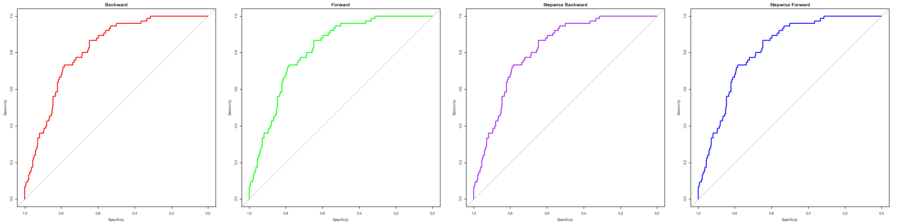
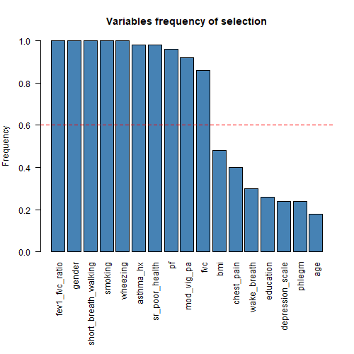

# COPD Risk Prediction
This repository documents an end-to-end pipeline in R for the estimation of the risk of occurrence of **COPD** (Chronic Obstructive Pulmonary Disease) in elderly population. The dataset includes 3,980 UK subjects with 18 predictive variables collected at baseline and a binary outcome (onset of COPD at 10 years).

**Dataset Description**
- Number of subjects: 3,980 adults.
- Number of predictive variables: 18 (clinical, demographic and lifestyle).
- Outcome: binary → development of COPD within 10 years (377 positive cases, 3,603 negative).
- Training set: 3,184 subjects (302 positive).
- Test set: 796 subjects (75 positive).
- Class imbalance: ~9.5% positive.

## Methodological Pipeline
### 1. Preprocessing
- **Data inspection**: Summary statistics and missing value counts per variable. Outcome imbalance: 377 positives vs. 3,603 negatives (~9.5% positive).
- **Train–test split**: Stratified sampling by outcome variable (80/20).
- **Rule-of-thumb check (EPV)**: After dummy encoding: 19 coefficients. Positive cases in training: 302. EPV = 15.89 ≥ 10 → condition satisfied.
- **Outlier detection and handling**: Boxplot-based inspection of numeric variables. Outliers (Threshold: mean ± 4 SD) replaced with missing values.
- **Multicollinearity check**: Correlation matrix computed for numeric predictors. Strong correlation: FEV1 vs FVC (ρ = 0.881), removed FEV1 to prevent redundancy.
- **Missing data imputation**: Numeric variables → mean imputation. Categorical variables → mode imputation.
- **Normalization**: Min–max scaling applied to numeric variables. Transformed range: [0,1] (test values possibly outside).
### 2. Model Training and Testing
- **Full model (logistic regression)**: Generalized linear model (binomial). Predictors: all available variables after preprocessing. Performance: AIC = 1578.1; Residual deviance = 1540.1 (df = 3165); Test set AUC = 0.814.
- **Evaluation metrics**: ROC curve analysis on test set. Discrimination ability considered satisfactory (AUC > 0.80).
### 3. Feature Selection
- **Backward elimination (AIC-based)**: Reduced model: AIC = 1568.8; Test set AUC = 0.818.
- **Alternative strategies**: Forward selection; Stepwise backward; Stepwise forward. All procedures converged to the same reduced model.
- **Stability selection (bootstrap, B = 50)**: Iterative preprocessing + backward elimination per bootstrap sample. Variable selection frequencies recorded; Stability threshold: ≥60% selection frequency. Final model (stable predictors): Test set AUC = 0.818.

## Results
- **Full model** (all predictors): AIC = 1578.1 — Test AUC = 0.814
- **Reduced model** (backward elimination, 11 predictors): AIC = 1568.8 — Test AUC = 0.818
- **Stable model** (bootstrap-selected predictors): Test AUC = 0.818

### Key finding:
- **Performance**: All models achieved AUC > 0.81; reduced and stable models slightly outperformed the full one (0.818 vs 0.814) with fewer predictors.
- **Feature stability**: Core predictors consistently retained (asthma_hx, fev1_fvc_ratio, gender, PF, short_breath_walking, smoking, wheezing).
- **Robustness**: Feature reduction improved interpretability without loss of accuracy; bootstrap confirmed stability of predictors.
- **Clinical alignment**: Selected variables match known COPD risk factors (smoking, spirometry, respiratory symptoms, asthma history, poor health status).

## Results

### ROC Curves
ROC curves for the reduced logistic regression models obtained with different feature selection strategies: (a) Backward, (b) Forward, (c) Stepwise Backward, and (d) Stepwise Forward.

### Feature Selection Stability
Barplot showing the frequency of selection for each variable across 50 bootstrap iterations. The dashed red line indicates the 60% selection threshold.

